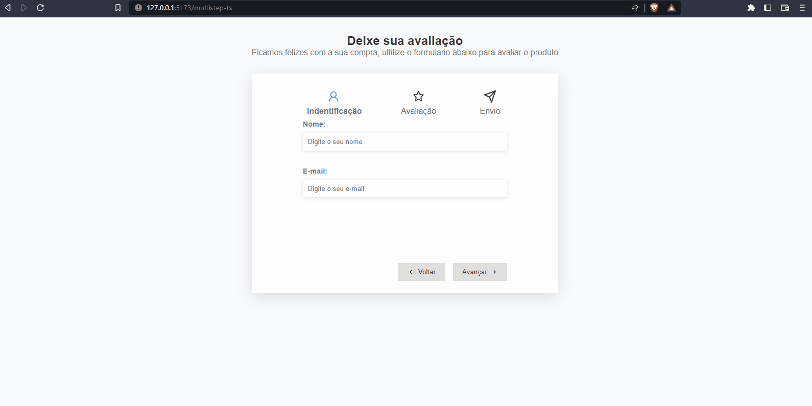

# multistep-ts

## Demonstração 🚀

 
## Construido com 

- Vite 
- typeScript
- CustomHooks
- React-icons

## Começando

Para colocar uma copia em execução, siga as estapas

### Pré requisitos

Instale o Node e o NPM usando `npm install` em linha de comando.

### Setup
clone o repositorio `git clone https://github.com/peterson1dhon/multistep-ts.git` no seu terminal.

### Instalar
Execute `npm install` em linha de comando, E rode com NPM RUN DEV.

### Author 

**PETERSON CAETANO**

### 💛 Contato

peterson.br94@gmail.com
